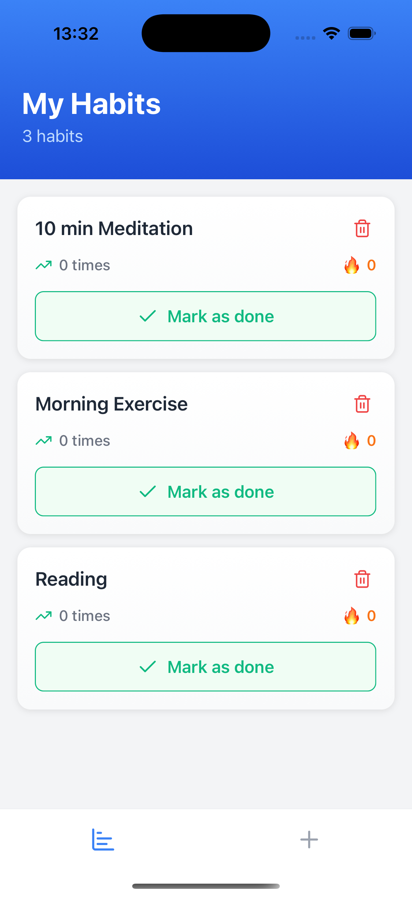
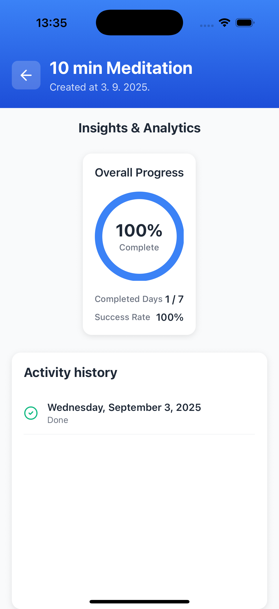
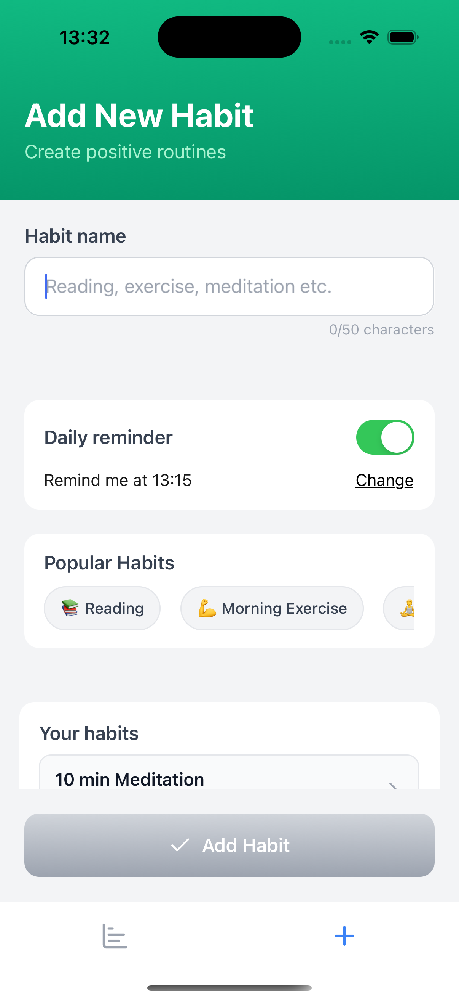

# Habit Tracker

A minimalist, offline‑first habit tracking app built with Expo, React Native, and TypeScript. Track daily habits, visualize progress with beautiful charts, and stay consistent with gentle reminders.


## ✨ Highlights
- Create and delete habits with one tap
- Toggle daily completion effortlessly
- Insights & analytics: completion rate, current/best streaks, trends
- Visualizations: donut completion chart, streak tiles, sparkline trend
- Daily reminders via push notifications (configurable time)
- Offline‑first data persistence using Expo SQLite
- Clean state management with Zustand

## 🎯 Why I built this
Consistent habits compound over time. I wanted a snappy mobile app that focuses on the essentials: clear progress, quick input, and motivational insights—without distractions.

## 🗺️ Features
- Habits
  - Add/remove habits
  - Toggle completion for today
  - See total completions and whether you’re done today
- Analytics (utils/habitAnalytics.tsx)
  - Completion rate (%) over selected period
  - Current and best streak detection
  - Sparkline: 7‑day rolling completion trend
  - Human‑friendly date labels (Today, Yesterday, N days ago)
- Visualizations (components/charts)
  - CompletionDonut: animated donut (react-native-svg + reanimated)
  - StreakVisualization: daily tile grid with start/end labels
  - MiniSparkline: compact trend line shown in InsightsCard
- Notifications (lib/notifications.ts)
  - Schedule or disable a daily reminder (Expo Notifications)
- Data (lib/database.ts)
  - Expo SQLite schema (habits, habit_logs)
  - Toggle completion with unique (habit_id, date)
  - Simple stats via queries and computed analytics

## 🏗️ Architecture
- Expo Router for file‑based navigation (app/*)
- Zustand store for state and async actions (stores/habitStore.tsx)
- SQLite data layer for local persistence (lib/database.ts)
- Analytics utilities for derived metrics (utils/habitAnalytics.tsx)
- Presentation components for charts and cards (components/charts/*)

Key screen:
- app/habit-detail.tsx
  - Header, Insights & Analytics (InsightsCard), and Activity History (FlatList)

## 🧰 Tech Stack
- React Native + Expo
- TypeScript
- Expo Router
- Expo SQLite
- Zustand
- Expo Notifications
- react-native-svg, react-native-reanimated

## 📸 Screenshots
Add your screenshots or GIFs here to showcase the experience.
- 
  
  
## 🚀 Getting Started
Prerequisites
- Node.js LTS
- Expo CLI (npx is fine)
- iOS Simulator (macOS) and/or Android Emulator, or Expo Go on your device

Install
```
npm install
```

Run
```
# Start Metro bundler
npx expo start

# Optional platform shortcuts
npm run ios
npm run android
npm run web
```

Notes
- First run will initialize the local SQLite database.
- Notifications: On first scheduling, the app will request permission. On Android, a channel "habits" is used.

## 🧪 Scripts
- start — expo start
- ios — expo run:ios
- android — expo run:android
- web — expo start --web
- lint — expo lint

## 📂 Project Structure (high level)
- app/ — screens and routes (Expo Router)
- components/charts/ — Donut, Streak, Sparkline, InsightsCard
- lib/ — database and notifications
- stores/ — Zustand store
- utils/ — analytics and helpers
- types/ — shared TypeScript types

## 🔮 Roadmap Ideas
- Custom schedules per habit (e.g., Mon/Wed/Fri)
- Multiple reminders and flexible times
- Editable history and backfilling
- Cloud sync and multi‑device
- Theming and accessibility improvements

## 🙌 Acknowledgements
- Expo and the RN community
- lucide-react-native icons

## 👤 About
Created by Bosko Jaksic.
- Website/Portfolio: https://portfolio-bosko-jaksic.vercel.app
- LinkedIn: https://www.linkedin.com/in/bosko-jaksic-9b746117a/
- Email: boskojaksic2407995@gmail.com
